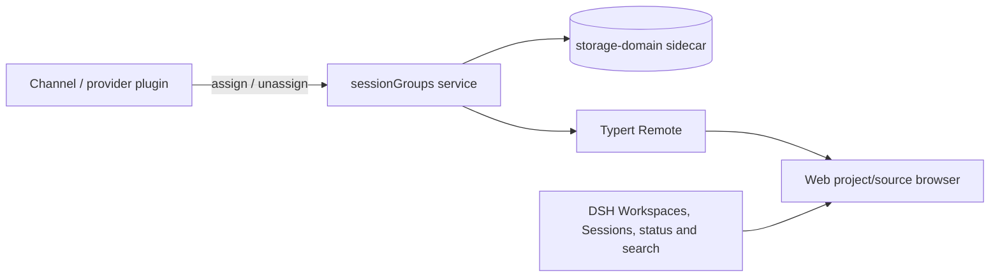

# dsh-session-groups

[简体中文](README.md)

[](https://github.com/deepseek-ai/deepseek-harness)
[](https://github.com/wheam/dsh-session-groups/actions/workflows/ci.yml)
[](packages/dsh-session-groups/LICENSE)

Project/source task navigation for the [DeepSeek Harness](https://github.com/deepseek-ai/deepseek-harness) Web sidebar.

Channel plugins attach a stable communication origin such as a Feishu chat, Slack channel, or Telegram conversation. `dsh-session-groups` keeps that origin independent from the Session's Workspace or working directory, so a Feishu-created task still appears under its real project by default and can be reorganized by source when needed.

> Installing this plugin adds the origin service and sidebar UI. A channel/provider plugin must call the [Provider API](#provider-api) before external source metadata appears.

## Why use it

The stock DSH sidebar works well for browsing by Workspace. Once Sessions also arrive from Feishu or other channels, however, project ownership and communication origin become two different questions. This plugin preserves the project view and adds an independent source view.

| What you need | Stock DSH sidebar | With this plugin |
| --- | --- | --- |
| Browse by project | Expands Sessions under registered Workspaces | Prefers real Workspaces and adds inferred directory projects plus a "No project" group |
| Find channel-created tasks | Does not distinguish the originating chat | Groups by apps such as Feishu, Slack, and Telegram and by concrete chat; project rows can still show the source |
| See what needs attention | Primarily presents the Session list | Aggregates waiting-user, failed-job, running, and unread-completion states in an Activity inbox |
| Search past work | Locate it in the current list | Searches titles, projects, sources, and DSH conversation content with result snippets |
| Organize many tasks | Uses the existing Workspace/Session order | Adds quick filters, source/chat/date filters, pinning, four sort modes, and drag ordering |
| Inspect history and execution | Provides common Session actions | Adds archive browsing, batch archive, and Job/Subagent details |

Existing Session actions—open, create, rename, fork, and archive—and Workspace registration actions remain available. The sidebar also adds folder opening, exact timestamps and metadata in tooltips, keyboard navigation, and icons and aliases for common messaging channels and coding agents.

## Install

Requirements: Node.js 22+, `pnpm`, and DeepSeek Harness `0.1.1-rc.2`.

Install the prebuilt release into the Web profile:

```bash
dsh plugin --profile web add https://github.com/wheam/dsh-session-groups/releases/download/v0.1.0/dsh-session-groups-0.1.0.tgz
```

Restart `dsh web` after installation. That is all that is required on the user side.

To install the current source version instead:

```bash
dsh plugin --profile web add 'github:wheam/dsh-session-groups#path:packages/dsh-session-groups'
```

The repository includes prebuilt runtime files, so the GitHub installation does not need an install-time build script.

### Update or remove

```bash
dsh plugin --profile web update dsh-session-groups
dsh plugin --profile web remove dsh-session-groups
```

Restart `dsh web` after either command.

## Provider API

Provider plugins attach one DSH Session to a communication source through the backwards-compatible `ctx.sessionGroups` API:

```ts
await ctx.sessionGroups.assign(sessionId, {
  id: providerStableGroupId,
  title: 'Chat with Zhang San',
  source: 'feishu',
  kind: 'private',
})
```

The assignment describes where the Session was initiated; it does not replace Workspace membership or `cwd`. Sessions with the same exact `source + id` are rendered under the same chat in source view. The newest assignment controls that chat's displayed title and kind. If a provider reserves an assignment but fails to create the Session, it can clean up with:

```ts
await ctx.sessionGroups.unassign(sessionId)
```

The service is added to the Cordis context through declaration merging, so TypeScript provider projects should depend on `dsh-session-groups` for its public types.

## How it works



- **Host:** a Cordis `TypertRemoteService` owns the provider-facing API.
- **Data:** communication-source assignments live in the `session_groups` storage-domain sidecar; project context remains owned by DSH Workspace and Session data.
- **Client:** a Typert Remote snapshot feeds source metadata into the Web sidebar; refreshes are coalesced and failures retain the last successful snapshot.
- **UI:** the plugin uses the official `sidebar.workspaces` slot priority mechanism to render project, source, Activity, and archive surfaces.

## Compatibility and limitations

| Item | Status |
| --- | --- |
| Verified DSH version | `0.1.1-rc.2` |
| Client | Web |
| Runtime | Node.js 22+ |
| Model experience | Unchanged |
| License | MIT |

DeepSeek Harness is in developer preview, so compatibility may break between release candidates. This version owns the complete `sidebar.workspaces` surface and reimplements the standard Workspace/Session list.

The verified DSH Runtime supports archiving but does not yet expose safe unarchive or permanent Session-delete APIs. Archived Sessions can be viewed, searched, and opened; restore and permanent deletion remain unavailable until those Runtime capabilities exist. Scheduled-task creation and cross-device preference sync are also outside this plugin's current scope.

## Data and permissions

- Writes only communication-source assignments to DSH's local `session_groups` storage domain and non-sensitive browser preferences to local storage.
- Reads local Session, Workspace, Job, Subagent, and Host search projections needed to render the sidebar.
- Conversation search uses DSH's existing local index and stores no second copy of message content.
- Does not modify prompts, model messages, Session logs, working directories, credentials, or external services.
- Makes no network requests of its own.

As with every in-process DSH plugin, the code runs with the permissions of the DSH process. Review third-party plugin source before installation.

## Development

```bash
git clone https://github.com/wheam/dsh-session-groups.git
cd dsh-session-groups
pnpm install
pnpm run check
```

For local development, link the package into the Web profile and restart DSH:

```bash
dsh plugin --profile web add "link:$PWD/packages/dsh-session-groups"
```

The `packages/typert-protocol-shim` workspace is build-only support for Typert symbol discovery in `0.1.1-rc.2`. Published runtime artifacts still reference the official `@deepseek-ai/dsh-typert-protocol` package.

See [CONTRIBUTING.md](CONTRIBUTING.md) for contribution instructions and [SECURITY.md](SECURITY.md) for private vulnerability reporting.

## License

[MIT](packages/dsh-session-groups/LICENSE)
