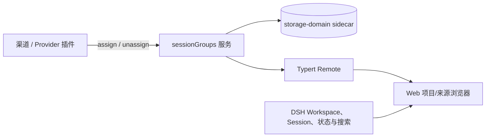

# dsh-session-groups

[English](README.en.md)

[](https://github.com/deepseek-ai/deepseek-harness)
[](https://github.com/wheam/dsh-session-groups/actions/workflows/ci.yml)
[](packages/dsh-session-groups/LICENSE)

为 [DeepSeek Harness](https://github.com/deepseek-ai/deepseek-harness) Web 左栏提供项目/来源双轴任务导航。

飞书、Slack、Telegram 等渠道插件可以为 Session 附加稳定的通信来源。`dsh-session-groups` 会把来源与 Workspace 或工作目录分开处理，因此飞书发起的任务默认仍归入真实项目，也可以随时切换为按来源查看。

> 安装本插件会加入来源服务和左栏 UI；只有当渠道/Provider 插件调用 [Provider API](#provider-api) 后，外部来源信息才会出现。

## 为什么用它

原生 DSH 左栏适合按 Workspace 查看任务；当 Session 同时来自本地项目、飞书或其他渠道时，它无法回答“属于哪个项目”和“从哪个聊天发起”这两个不同的问题。本插件在保留项目归属的同时，增加独立的通信来源视图。

| 你想做的事 | 原生 DSH 左栏 | 安装本插件后 |
| --- | --- | --- |
| 按项目查看任务 | 按已注册 Workspace 展开 Session | 优先使用真实 Workspace，并补充目录项目和“无项目”分组 |
| 找到渠道发起的任务 | 不区分 Session 来自哪个聊天 | 可按飞书、Slack、Telegram 等应用及具体聊天分组，也能在项目视图看到来源 |
| 发现需要处理的任务 | 以 Session 列表为主 | 聚合等待用户、后台失败、运行中和未读完成状态，并集中到 Activity 收件箱 |
| 搜索历史任务 | 在当前列表中定位 | 同时搜索标题、项目、来源和 DSH 对话正文，并显示命中片段 |
| 整理大量任务 | 使用 Workspace/Session 的既有顺序 | 支持快捷筛选、来源/聊天/日期筛选、置顶、四种排序和拖拽排序 |
| 查看历史与执行细节 | 提供常用 Session 操作 | 增加归档浏览、批量归档以及 Job/Subagent 详情 |

打开、新建、重命名、分叉和归档 Session，以及添加、重命名、排序和删除 Workspace 注册等原有操作仍然保留。左栏还提供打开项目文件夹、精确更新时间与元数据 tooltip、键盘上下导航，以及常见消息渠道和编码 Agent 的图标与别名。

## 安装

要求：Node.js 22+、`pnpm`、DeepSeek Harness `0.1.1-rc.2`。

把预构建版本安装到 Web profile：

```bash
dsh plugin --profile web add https://github.com/wheam/dsh-session-groups/releases/download/v0.1.0/dsh-session-groups-0.1.0.tgz
```

安装后重启 `dsh web`，用户侧不需要其他配置。

如果希望直接安装 GitHub 当前源码版本：

```bash
dsh plugin --profile web add 'github:wheam/dsh-session-groups#path:packages/dsh-session-groups'
```

仓库已经提交预构建运行文件，因此 GitHub 安装不需要执行安装期构建脚本。

### 更新或卸载

```bash
dsh plugin --profile web update dsh-session-groups
dsh plugin --profile web remove dsh-session-groups
```

执行后请重启 `dsh web`。

## Provider API

渠道 Provider 通过兼容现有接入的 `ctx.sessionGroups` API，为 DSH Session 附加通信来源：

```ts
await ctx.sessionGroups.assign(sessionId, {
  id: providerStableGroupId,
  title: '与张三的私聊',
  source: 'feishu',
  kind: 'private',
})
```

assignment 只说明 Session 从哪里发起，不会取代 Workspace membership 或 `cwd`。精确 `source + id` 相同的 Session 会在来源视图进入同一个聊天；最新 assignment 决定聊天显示名称和类型。如果 Provider 预留了来源关系，但创建 Session 失败，可以清理：

```ts
await ctx.sessionGroups.unassign(sessionId)
```

服务通过声明合并加入 Cordis context。使用 TypeScript 的 Provider 项目应依赖 `dsh-session-groups`，以获得公开类型。

## 工作原理



- **Host：**Cordis `TypertRemoteService` 提供 Provider API。
- **数据：**通信来源存储在 `session_groups` storage-domain sidecar；项目上下文继续由 DSH Workspace 与 Session 数据拥有。
- **Client：**Typert Remote 快照向 Web 左栏提供来源信息；刷新请求会合并，失败时保留上一次成功数据。
- **UI：**通过官方 `sidebar.workspaces` slot 的优先级机制渲染项目、来源、Activity 和归档界面。

## 兼容性与限制

| 项目 | 状态 |
| --- | --- |
| 已验证 DSH 版本 | `0.1.1-rc.2` |
| 客户端 | Web |
| 运行时 | Node.js 22+ |
| 模型体验 | 不变 |
| 许可证 | MIT |

DeepSeek Harness 仍处于开发者预览阶段，不同候选版本之间可能出现破坏性变化。当前版本需要接管完整的 `sidebar.workspaces` surface，并重新实现标准 Workspace/Session 列表。

已验证的 DSH Runtime 支持归档，但尚未暴露安全的取消归档或永久删除 Session API。归档 Session 可以查看、搜索和打开；恢复与永久删除需要等待 Runtime 提供对应能力。Scheduled 任务创建和跨设备偏好同步也不在本插件当前范围内。

## 数据与权限

- 只向 DSH 本地 `session_groups` storage domain 写入通信来源关系，并向浏览器本地存储写入不敏感的浏览偏好。
- 只读取渲染左栏所需的本地 Session、Workspace、Job、Subagent 和 Host 搜索投影。
- 对话搜索使用 DSH 现有本地索引，不另存一份消息正文。
- 不修改 Prompt、模型消息、Session 日志、工作目录、凭据或外部服务。
- 自身不发起网络请求。

和所有 DSH 进程内插件一样，本插件代码拥有 DSH 进程的权限。安装任何第三方插件前都应先检查源码。

## 开发

```bash
git clone https://github.com/wheam/dsh-session-groups.git
cd dsh-session-groups
pnpm install
pnpm run check
```

本地开发时，可把包链接进 Web profile，然后重启 DSH：

```bash
dsh plugin --profile web add "link:$PWD/packages/dsh-session-groups"
```

`packages/typert-protocol-shim` 只用于补齐 `0.1.1-rc.2` Typert generator 的 workspace 符号发现。发布运行产物仍引用官方 `@deepseek-ai/dsh-typert-protocol`。

贡献说明见 [CONTRIBUTING.md](CONTRIBUTING.md)，私下报告安全漏洞的方法见 [SECURITY.md](SECURITY.md)。

## 许可证

[MIT](packages/dsh-session-groups/LICENSE)
