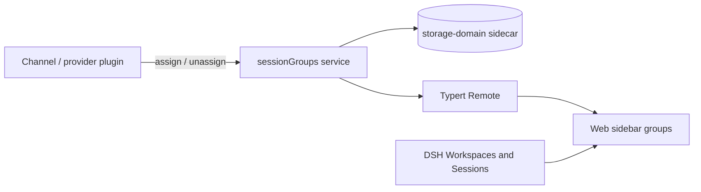

# dsh-session-groups

[简体中文](README.zh-CN.md)

[](https://github.com/deepseek-ai/deepseek-harness)
[](https://github.com/wheam/dsh-session-groups/actions/workflows/ci.yml)
[](packages/dsh-session-groups/LICENSE)

Provider-owned virtual session groups for the [DeepSeek Harness](https://github.com/deepseek-ai/deepseek-harness) Web sidebar.

Channel plugins can group sessions by a stable identity such as a Feishu chat, Slack channel, or Telegram conversation. `dsh-session-groups` renders those virtual groups next to real DSH Workspaces without changing session working directories, Workspace records, or conversation logs.

> Installing this plugin adds the grouping service and sidebar UI. A channel/provider plugin must call the [Provider API](#provider-api) before virtual groups appear.

## Features

- Durable, provider-neutral assignments keyed by `source + id`.
- Real Workspaces, virtual groups, and ungrouped sessions in one sidebar.
- Built-in source icons for Feishu/Lark, Slack, Teams, DingTalk, Telegram, Discord, WeChat, WhatsApp, Google Chat, Mattermost, Matrix, Signal, LINE, Messenger, iMessage, KakaoTalk, Viber, Rocket.Chat, Zulip, QQ, Gmail, Zoom, and common aliases.
- Existing session and Workspace actions: open, create, rename, fork, archive, add, and delete.
- Local DSH storage only; no external network requests, credentials, model tools, or prompt changes.

## Install

Requirements: Node.js 22+, `pnpm`, and DeepSeek Harness `0.1.1-rc.2`.

Install the prebuilt release into the Web profile:

```bash
dsh plugin --profile web add https://github.com/wheam/dsh-session-groups/releases/download/v0.1.0/dsh-session-groups-0.1.0.tgz
```

Restart `dsh web` after installation. That is all that is required on the user side.

To install the current source version instead:

```bash
dsh plugin --profile web add 'github:wheam/dsh-session-groups#path:packages/dsh-session-groups'
```

The repository includes prebuilt runtime files, so the GitHub installation does not need an install-time build script.

### Update or remove

```bash
dsh plugin --profile web update dsh-session-groups
dsh plugin --profile web remove dsh-session-groups
```

Restart `dsh web` after either command.

## Provider API

Provider plugins assign a DSH Session to a virtual group through `ctx.sessionGroups`:

```ts
await ctx.sessionGroups.assign(sessionId, {
  id: providerStableGroupId,
  title: 'Chat with Zhang San',
  source: 'feishu',
  kind: 'private',
})
```

Sessions with the same `source + id` are rendered together. The newest assignment controls the displayed title. If a provider reserves an assignment but fails to create the Session, it can clean up with:

```ts
await ctx.sessionGroups.unassign(sessionId)
```

The service is added to the Cordis context through declaration merging, so TypeScript provider projects should depend on `dsh-session-groups` for its public types.

## How it works



- **Host:** a Cordis `TypertRemoteService` owns the provider-facing API.
- **Data:** assignments live in the `session_groups` storage-domain sidecar.
- **Client:** a Typert Remote snapshot feeds the Web sidebar; refreshes are coalesced and failures retain the last successful snapshot.
- **UI:** the plugin uses the official `sidebar.workspaces` slot priority mechanism to render a combined browser.

## Compatibility and limitations

| Item | Status |
| --- | --- |
| Verified DSH version | `0.1.1-rc.2` |
| Client | Web |
| Runtime | Node.js 22+ |
| Model experience | Unchanged |
| License | MIT |

DeepSeek Harness is in developer preview, so compatibility may break between release candidates. This version owns the complete `sidebar.workspaces` surface and reimplements the standard Workspace/Session list. It preserves the common actions and title search, but does not currently reproduce full conversation-content search or drag sorting from the stock browser.

## Data and permissions

- Writes only virtual-group assignments to DSH's local `session_groups` storage domain.
- Reads the local Session and Workspace projections needed to render the sidebar.
- Does not read or modify prompts, model messages, Session logs, Workspace paths, credentials, or external services.
- Makes no network requests of its own.

As with every in-process DSH plugin, the code runs with the permissions of the DSH process. Review third-party plugin source before installation.

## Development

```bash
git clone https://github.com/wheam/dsh-session-groups.git
cd dsh-session-groups
pnpm install
pnpm run check
```

For local development, link the package into the Web profile and restart DSH:

```bash
dsh plugin --profile web add "link:$PWD/packages/dsh-session-groups"
```

The `packages/typert-protocol-shim` workspace is build-only support for Typert symbol discovery in `0.1.1-rc.2`. Published runtime artifacts still reference the official `@deepseek-ai/dsh-typert-protocol` package.

See [CONTRIBUTING.md](CONTRIBUTING.md) for contribution instructions and [SECURITY.md](SECURITY.md) for private vulnerability reporting.

## License

[MIT](packages/dsh-session-groups/LICENSE)
