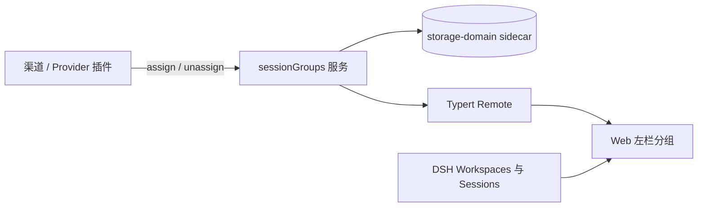

# dsh-session-groups

[English](README.md)

[](https://github.com/deepseek-ai/deepseek-harness)
[](https://github.com/wheam/dsh-session-groups/actions/workflows/ci.yml)
[](packages/dsh-session-groups/LICENSE)

为 [DeepSeek Harness](https://github.com/deepseek-ai/deepseek-harness) Web 左栏提供由渠道 Provider 管理的虚拟会话分组。

飞书、Slack、Telegram 等渠道插件可以使用稳定的渠道身份对 Session 分组。`dsh-session-groups` 会把真实 DSH Workspace、虚拟分组和未分组 Session 合并显示，同时不修改 Session 工作目录、Workspace 记录或对话日志。

> 安装本插件会加入分组服务和左栏 UI；只有当渠道/Provider 插件调用 [Provider API](#provider-api) 后，虚拟分组才会出现。

## 功能

- 使用 `source + id` 作为稳定、与渠道实现无关的分组身份。
- 在同一个左栏中显示真实 Workspace、虚拟分组和未分组 Session。
- 内置飞书/Lark、Slack、Teams、钉钉、Telegram、Discord、微信、WhatsApp、Google Chat、Mattermost、Matrix、Signal、LINE、Messenger、iMessage、KakaoTalk、Viber、Rocket.Chat、Zulip、QQ、Gmail、Zoom 等来源图标及常见别名。
- 保留打开、新建、重命名、分叉、归档 Session，以及添加、重命名、删除 Workspace 等常用操作。
- 只使用 DSH 本地存储；不发起外部网络请求，不读取凭据，不增加模型工具，也不修改 Prompt。

## 安装

要求：Node.js 22+、`pnpm`、DeepSeek Harness `0.1.1-rc.2`。

把预构建版本安装到 Web profile：

```bash
dsh plugin --profile web add https://github.com/wheam/dsh-session-groups/releases/download/v0.1.0/dsh-session-groups-0.1.0.tgz
```

安装后重启 `dsh web`，用户侧不需要其他配置。

如果希望直接安装 GitHub 当前源码版本：

```bash
dsh plugin --profile web add 'github:wheam/dsh-session-groups#path:packages/dsh-session-groups'
```

仓库已经提交预构建运行文件，因此 GitHub 安装不需要执行安装期构建脚本。

### 更新或卸载

```bash
dsh plugin --profile web update dsh-session-groups
dsh plugin --profile web remove dsh-session-groups
```

执行后请重启 `dsh web`。

## Provider API

渠道 Provider 通过 `ctx.sessionGroups` 把 DSH Session 放入虚拟分组：

```ts
await ctx.sessionGroups.assign(sessionId, {
  id: providerStableGroupId,
  title: '与张三的私聊',
  source: 'feishu',
  kind: 'private',
})
```

相同 `source + id` 的 Session 会进入同一组；最新一次 assignment 决定显示名称。如果 Provider 预留了分组关系，但创建 Session 失败，可以清理：

```ts
await ctx.sessionGroups.unassign(sessionId)
```

服务通过声明合并加入 Cordis context。使用 TypeScript 的 Provider 项目应依赖 `dsh-session-groups`，以获得公开类型。

## 工作原理



- **Host：**Cordis `TypertRemoteService` 提供 Provider API。
- **数据：**分组关系存储在 `session_groups` storage-domain sidecar。
- **Client：**Typert Remote 快照驱动 Web 左栏；刷新请求会合并，失败时保留上一次成功数据。
- **UI：**通过官方 `sidebar.workspaces` slot 的优先级机制渲染组合后的浏览器。

## 兼容性与限制

| 项目 | 状态 |
| --- | --- |
| 已验证 DSH 版本 | `0.1.1-rc.2` |
| 客户端 | Web |
| 运行时 | Node.js 22+ |
| 模型体验 | 不变 |
| 许可证 | MIT |

DeepSeek Harness 仍处于开发者预览阶段，不同候选版本之间可能出现破坏性变化。当前版本需要接管完整的 `sidebar.workspaces` surface，并重新实现标准 Workspace/Session 列表。它保留了常用操作与标题搜索，但尚未复刻官方左栏的对话正文全文搜索和拖拽排序。

## 数据与权限

- 只向 DSH 本地 `session_groups` storage domain 写入虚拟分组关系。
- 只读取渲染左栏所需的本地 Session 和 Workspace 投影。
- 不读取或修改 Prompt、模型消息、Session 日志、Workspace 路径、凭据或外部服务。
- 自身不发起网络请求。

和所有 DSH 进程内插件一样，本插件代码拥有 DSH 进程的权限。安装任何第三方插件前都应先检查源码。

## 开发

```bash
git clone https://github.com/wheam/dsh-session-groups.git
cd dsh-session-groups
pnpm install
pnpm run check
```

本地开发时，可把包链接进 Web profile，然后重启 DSH：

```bash
dsh plugin --profile web add "link:$PWD/packages/dsh-session-groups"
```

`packages/typert-protocol-shim` 只用于补齐 `0.1.1-rc.2` Typert generator 的 workspace 符号发现。发布运行产物仍引用官方 `@deepseek-ai/dsh-typert-protocol`。

贡献说明见 [CONTRIBUTING.md](CONTRIBUTING.md)，私下报告安全漏洞的方法见 [SECURITY.md](SECURITY.md)。

## 许可证

[MIT](packages/dsh-session-groups/LICENSE)
